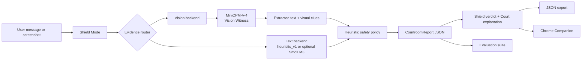

# Scam Court AI

## 3-Second Scam Shield + AI Courtroom Explanation

[](https://huggingface.co/spaces/build-small-hackathon/scam-court-ai)
[](https://github.com/jpablortiz96/Scam-Court-AI)
[](https://www.gradio.app/)
[](https://huggingface.co/openbmb/MiniCPM-V-4)
[](docs/EVALUATION.md)
[](LICENSE)

Scam Court AI helps people pause before they click, pay, or share a code. It
returns one immediate action - `STOP`, `VERIFY FIRST`, or `LOW VISIBLE RISK` -
then shows the evidence through an explainable five-role courtroom.

**[Try the live Hugging Face Space](https://huggingface.co/spaces/build-small-hackathon/scam-court-ai)**
| **[View the GitHub repository](https://github.com/jpablortiz96/Scam-Court-AI)**
| **Hugging Face Build Small Hackathon**

> The shield comes first. The explanation follows.

## Why This Exists

Scams happen in seconds. A fake bank warning, delivery link, family emergency,
marketplace deposit request, or OTP prompt can push someone toward an
irreversible action before they have time to investigate.

For older adults and families, copying a message into a general chatbot,
writing a careful prompt, and interpreting a long answer is too much friction
at the moment of risk. Scam Court AI is designed around a different sequence:

1. Give one calm safety action immediately.
2. Preserve uncertainty instead of offering false reassurance.
3. Explain the visible evidence in plain language.
4. Provide a safe verification path through an official channel or trusted person.

## Product Modes

| Mode | What it does |
|---|---|
| **Shield Mode** | Analyzes pasted text and optional screenshots, then prioritizes the safest immediate action. |
| **Court Mode** | Turns the same structured report into Detective, Prosecutor, Defender, Judge, and Safety Clerk explanations. |
| **Suspicious Call / Call Check** | Uses five fast questions to interrupt money, code, impersonation, urgency, and secrecy pressure during a call. |
| **Companion Preview** | Demonstrates how the Shield result can appear inside WhatsApp, SMS, and marketplace workflows. |
| **Vision Witness** | Uses `openbmb/MiniCPM-V-4` to extract visible screenshot text and visual risk clues before policy analysis. |
| **Chrome Companion Prototype** | Sends only explicitly selected text to the named Gradio endpoint after a user-triggered context-menu action. |

Every mode renders from a structured `CourtroomReport`, making the decision
inspectable, exportable, and reusable by the browser companion and evaluation
tools.

## Screenshots

No production screenshots are committed yet. The capture slots below are
intentional: replace each placeholder with a real product capture before final
submission; do not use fabricated UI images.

| Product view | Capture slot |
|---|---|
| Shield Mode | Add screenshot here: `docs/assets/screenshots/shield-mode.png` |
| Vision Witness | Add screenshot here: `docs/assets/screenshots/vision-witness.png` |
| Court Mode | Add screenshot here: `docs/assets/screenshots/court-mode.png` |
| Call Check | Add screenshot here: `docs/assets/screenshots/call-check.png` |
| Companion Preview | Add screenshot here: `docs/assets/screenshots/companion-preview.png` |
| Chrome Companion | Add screenshot here: `docs/assets/screenshots/chrome-companion.png` |

Capture guidance lives in
[`docs/assets/screenshots/README.md`](docs/assets/screenshots/README.md).

## Architecture



The default runtime is deterministic and CPU-safe. Optional model paths are
lazy-loaded and must fail toward verification, never false confidence.

See [`docs/ARCHITECTURE.md`](docs/ARCHITECTURE.md) for the component map,
ZeroGPU lifecycle, MiniCPM-V loading path, fallback policy, Chrome Companion
bridge, and evaluation architecture.

## Models and Small-Model Strategy

| Layer | Implementation | Responsibility |
|---|---|---|
| Text safety engine | `heuristic_v1` | Default pattern detection, weighted scoring, policy enforcement, and offline fallback |
| Optional text model | `HuggingFaceTB/SmolLM3-3B` | Lazy-loaded structured reasoning scaffold with heuristic fallback |
| Vision Witness | `openbmb/MiniCPM-V-4` | Screenshot text extraction, screenshot classification, and visual clues |
| Experience layer | Gradio + courtroom personas | Immediate safety action and human-readable explanation |

These components remain within the Build Small model rules. Small models fit
the product because the task is narrow and action-oriented: extract bounded
evidence, apply a conservative policy, produce structured output, and recover
safely when a model is unavailable. That makes the system faster to inspect,
easier to evaluate, and practical on constrained hardware.

## Safety Philosophy

Scam Court AI is a safety action recommender, not a proof-of-fraud system.

- Incomplete evidence must not produce a false `LOW VISIBLE RISK`.
- Screenshot failure defaults to `VERIFY FIRST`.
- Links and requests for action require independent verification.
- The app never asks users to share OTPs, passwords, PINs, or recovery codes.
- The app never tells users to click a suspicious link to verify a message.
- Verification should use an official app, manually typed website, saved phone number, or trusted contact.
- `LOW VISIBLE RISK` means no strong visible signal was detected; it is not a guarantee.
- The product is not a legal, financial, law-enforcement, or cybersecurity authority.

Do not submit passwords, live OTPs, payment-card data, government identifiers,
or other secrets to a demo application.

## Evaluation and Safety Metrics

The committed synthetic suite contains **60 cases across 10 categories** and
tests the action policy rather than claiming general real-world detection
accuracy.

| Current deterministic baseline | Result |
|---|---:|
| Cases passed | 60 / 60 |
| Verdict accuracy | 100% |
| Score-range accuracy | 100% |
| False `LOW VISIBLE RISK` results | 0 |
| Safety failures | 0 |
| STOP recall | 100% |

The primary safety concern is false reassurance: an uncertain or high-risk case
must not be labeled low risk. The dataset records expected verdicts, acceptable
score ranges, policy tags, and no-low-risk guardrails.

```powershell
python tools/evaluate_cases.py
```

Inputs and implementation:

- [`data/evaluation_cases.json`](data/evaluation_cases.json)
- [`tools/evaluate_cases.py`](tools/evaluate_cases.py)
- [`docs/EVALUATION.md`](docs/EVALUATION.md)
- Generated locally after a run: `outputs/evaluation_report.md`

For a regression command that exits on a safety failure:

```powershell
python tools/evaluate_cases.py --fail-on-safety
```

## Run Locally

Prerequisite: Python 3.10 or newer.

```powershell
git clone https://github.com/jpablortiz96/Scam-Court-AI.git
cd Scam-Court-AI
python -m venv .venv
.\.venv\Scripts\Activate.ps1
python -m pip install -r requirements.txt
Copy-Item .env.example .env
python app.py
```

Open [http://localhost:7860](http://localhost:7860).

CPU-safe defaults require no secrets:

```env
SCAM_COURT_BACKEND=heuristic
SCAM_COURT_VISION_BACKEND=none
SCAM_COURT_VISION_MODEL=openbmb/MiniCPM-V-4
```

Enable local vision only on a machine with sufficient resources:

```env
SCAM_COURT_VISION_BACKEND=minicpm_v
```

OS environment variables take precedence over `.env`. Hugging Face and Modal
credentials are optional and should be supplied through their normal secret or
CLI mechanisms, never committed.

## Deploy to Hugging Face Spaces

The YAML block at the top of this README is required Space metadata. Create or
duplicate a **Gradio Space**, push the repository, and configure these Space
variables:

```text
SCAM_COURT_BACKEND=heuristic
SCAM_COURT_VISION_BACKEND=minicpm_v
SCAM_COURT_VISION_MODEL=openbmb/MiniCPM-V-4
```

For screenshot inference, select **ZeroGPU** hardware. The shared
`analyze_message` handler is registered through the real `@spaces.GPU`
decorator, while MiniCPM-V remains lazy-loaded until a screenshot request
arrives. If vision loading, inference, or extraction fails, screenshot-only
analysis resolves to `VERIFY FIRST`.

For a CPU-only deployment, set:

```text
SCAM_COURT_VISION_BACKEND=none
```

The local compatibility wrapper becomes a no-op when ZeroGPU is unavailable.
See [`docs/DEPLOYMENT.md`](docs/DEPLOYMENT.md) for startup diagnostics and
fallback details.

## Chrome Companion

The prototype is in [`chrome_companion/`](chrome_companion/).

1. Open `chrome://extensions`.
2. Enable **Developer mode**.
3. Click **Load unpacked**.
4. Select the repository's `chrome_companion` folder.
5. Select suspicious text on a normal webpage.
6. Right-click and choose **Take this to Scam Court**.

Privacy and failure boundaries:

- analysis is user-triggered only;
- only selected text is sent;
- there is no background page or message monitoring;
- selected messages are not stored;
- API failure returns `VERIFY FIRST`, never a low-risk result.

The popup can target the public Space or `http://localhost:7860`. The extension
calls the named Gradio `analyze_text` endpoint and does not invoke screenshot
vision. Full setup and limitations are documented in
[`docs/CHROME_COMPANION_PROTOTYPE.md`](docs/CHROME_COMPANION_PROTOTYPE.md).

## Demo and Submission

A judge-ready 60-90 second flow:

1. Upload a synthetic suspicious delivery screenshot.
2. Show MiniCPM-V extracting the visible evidence.
3. Show the Shield returning `VERIFY FIRST` and the instruction not to click.
4. Open Court Mode and reveal the five-role explanation.
5. Run the active-call rescue flow.
6. Analyze selected text through the Chrome Companion.
7. Close on the 60-case safety evaluation and live Space URL.

Use [`docs/DEMO_PLAN.md`](docs/DEMO_PLAN.md) for the shot list and
[`docs/SUBMISSION_COPY.md`](docs/SUBMISSION_COPY.md) for the project
description, video copy, and social post draft.

## Privacy and Limitations

- CPU-safe local mode does not require a third-party model API.
- The public Space processes evidence inside its Hugging Face runtime.
- The application does not intentionally persist uploaded screenshots or message text.
- Runtime diagnostics avoid logging message and screenshot contents.
- JSON export is initiated by the user.
- The heuristic engine is English-first and can miss novel wording.
- Risk scores are policy severity indicators, not calibrated probabilities.
- The synthetic evaluation set is balanced for policy coverage, not population prevalence.
- The app does not perform live sender, domain, bank, carrier, or payment verification.
- Vision extraction can fail on cropped, low-resolution, or visually complex screenshots.

## Roadmap

- Harden the Chrome Companion API bridge and browser test coverage.
- Fine-tune and evaluate a small text model on safety-focused structured outputs.
- Add a family trusted-contact mode.
- Explore native WhatsApp and SMS integrations with explicit consent.
- Expand multilingual safety copy and evaluation cases.

## Build Small Positioning

The public implementation supports the hackathon's **Backyard AI**, **OpenBMB**,
**Off-Brand**, **Best Agent**, **Best Demo**, **Modal**, and **Field Notes**
categories through a family safety use case, working MiniCPM-V vision,
non-chatbot Gradio interface, structured courtroom trace, reproducible
evaluation, and documented build story.

## Public Documentation

- [`docs/ARCHITECTURE.md`](docs/ARCHITECTURE.md) - system and integration architecture
- [`docs/EVALUATION.md`](docs/EVALUATION.md) - methodology, metrics, and limitations
- [`docs/DEPLOYMENT.md`](docs/DEPLOYMENT.md) - Hugging Face and ZeroGPU deployment
- [`docs/INTEGRATION_CONTRACT.md`](docs/INTEGRATION_CONTRACT.md) - `CourtroomReport` contract
- [`docs/FIELD_NOTES.md`](docs/FIELD_NOTES.md) - product and engineering narrative
- [`data/agent_trace_example.json`](data/agent_trace_example.json) - representative public trace

## License

MIT. See [`LICENSE`](LICENSE).
