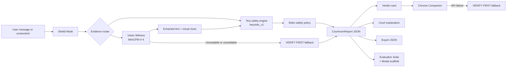

# Scam Court AI

## 3-Second Scam Shield + AI Courtroom Explanation

[](https://huggingface.co/spaces/build-small-hackathon/scam-court-ai)
[](https://github.com/jpablortiz96/Scam-Court-AI)
[](https://huggingface.co/build-small-hackathon)
[](https://huggingface.co/openbmb/MiniCPM-V-4)
[](docs/EVALUATION.md)
[](LICENSE)

**Scam Court AI is a safety pause for the moment before someone clicks, pays,
or shares a code.** It gives one clear action first - `STOP`, `VERIFY FIRST`,
or `LOW VISIBLE RISK` - then explains the visible evidence through an
inspectable five-role AI courtroom.

**[Launch the live Space](https://huggingface.co/spaces/build-small-hackathon/scam-court-ai)**
| **[Explore the source](https://github.com/jpablortiz96/Scam-Court-AI)**
| **Hugging Face + Gradio Build Small Hackathon**

> The shield comes first. The explanation follows.

## Build Small Hackathon Submission

| Submission field | Details |
|---|---|
| **Project** | Scam Court AI |
| **Eligible Track** | Backyard AI |
| **Live Gradio Space** | [https://huggingface.co/spaces/build-small-hackathon/scam-court-ai](https://huggingface.co/spaces/build-small-hackathon/scam-court-ai) |
| **Demo Video** | [https://youtu.be/Z8yVgiFjQf8](https://youtu.be/Z8yVgiFjQf8) |
| **GitHub Repository** | [https://github.com/jpablortiz96/Scam-Court-AI](https://github.com/jpablortiz96/Scam-Court-AI) |
| **Social Post** | [https://www.linkedin.com/feed/update/urn:li:activity:7472375840933187585](https://www.linkedin.com/feed/update/urn:li:activity:7472375840933187585) |

### Eligibility Checklist

- [x] **Small Models Only:** every model used by the project is under the
  32B-parameter cap.
- [x] **Gradio App:** deployed as a Gradio Space inside the official
  `build-small-hackathon` Hugging Face organization.
- [x] **Demo Video:** [watch the final YouTube demo](https://youtu.be/Z8yVgiFjQf8).
- [x] **Social Post:** [view the final LinkedIn post](https://www.linkedin.com/feed/update/urn:li:activity:7472375840933187585).
- [x] **ZeroGPU Limit:** this submission uses one ZeroGPU Space.

### Submission Models

- `heuristic_v1` deterministic text safety engine.
- `openbmb/MiniCPM-V-4` Vision Witness for screenshot evidence.
- Optional `HuggingFaceTB/SmolLM3-3B` backend scaffold with deterministic
  fallback. It remains within the 32B rule.

### Prize and Badge Positioning

**Backyard AI · OpenBMB Awards · Off-Brand · Best Agent · Best Demo · Field
Notes · Modal Awards · Best Use of Codex**

For **Best Use of Codex**, Codex was used holistically across the project:
UI/UX refactoring, Gradio compatibility fixes, Hugging Face Space deployment,
ZeroGPU integration, README and architecture documentation, the evaluation
suite, Chrome Companion prototype, and final submission polish.

### Submission Safety Notes

- Screenshot analysis failure returns `VERIFY FIRST`, never a low-risk result.
- Suspicious links and action requests require verification through an
  independently opened official channel.
- OTP codes, passwords, money, secrecy, gift cards, and crypto requests
  escalate toward `STOP`.
- Chrome Companion is user-triggered and selected-text only; it does not
  monitor pages in the background.


## The Moment of Risk

Fraud is not a marginal problem:

- The US Federal Trade Commission says consumers reported losing **more than
  $12.5 billion to fraud in 2024**, a **25% year-over-year increase**.
  [FTC, March 2025](https://www.ftc.gov/news-events/news/press-releases/2025/03/new-ftc-data-show-big-jump-reported-losses-fraud-125-billion-2024)
- Imposter scams alone accounted for **$2.95 billion** in reported 2024 losses.
  [FTC Consumer Sentinel Network Data Book 2024](https://www.ftc.gov/reports/consumer-sentinel-network-data-book-2024)
- In 2023, people over 60 reported more than **$3.4 billion** in losses to the
  FBI's Internet Crime Complaint Center, with an **average victim loss of
  $33,915**.
  [FBI IC3 Elder Fraud Report 2023 (PDF)](https://www.ic3.gov/AnnualReport/Reports/2023_IC3ElderFraudReport.pdf)
- In 2024, the FBI recorded **147,127 complaints from people 60+** and
  **$4.885 billion in reported losses**, increases of 46% and 43% respectively.
  [FBI IC3 Annual Report 2024 (PDF)](https://www.ic3.gov/AnnualReport/Reports/2024_IC3Report.pdf)

The gap is not simply awareness. People already know scams exist. The failure
often happens during the pressured minute when a caller demands secrecy, an SMS
contains a delivery link, WhatsApp shows a "new number" family emergency, or a
bank impersonator asks for an OTP.

Copying the message into a general chatbot, composing a careful prompt, and
interpreting a long answer is too slow for that moment.

## Product Thesis

**Scam Court AI is not a chatbot. It is a safety pause.**

The product is ordered around human decision-making:

1. Interrupt momentum with one clear action.
2. Preserve uncertainty instead of offering false reassurance.
3. Show the evidence in language a family can discuss.
4. Provide a safe verification path through an official channel or trusted person.
5. Export the structured decision for integrations and evaluation.

## Core Experience

| Surface | Purpose |
|---|---|
| **Shield Mode** | Returns the immediate verdict, risk score, safest action, and a trusted-contact script. |
| **Vision Witness** | Uses `openbmb/MiniCPM-V-4` to extract screenshot text, context, confidence, and visual clues. |
| **Court Mode** | Separates the explanation into Detective, Prosecutor, Defender, Judge, and Safety Clerk roles. |
| **Suspicious Call / Call Check** | Uses five fast warning-sign questions to help someone leave a pressured call. |
| **Companion Preview** | Demonstrates Shield results inside WhatsApp, SMS, and marketplace-style conversations. |
| **Chrome Companion** | Runs only after a user selects text and explicitly chooses **Take this to Scam Court**. |
| **CourtroomReport JSON** | Records evidence, verdict, actions, provenance, limitations, and the role-by-role trace. |

All surfaces consume the same structured decision contract. The courtroom is
an explanation layer, not a collection of disconnected model calls.

## Product Proof

The screenshots below use synthetic messages and real project renderers. The
Vision Witness captures are backed by an actual local MiniCPM-V-4 run; the
Chrome capture executes the committed extension's `content.js` and `styles.css`.

| Mode | Screenshot | What it proves |
|---|---|---|
| **Vision Witness** |  | Screenshot status, type, confidence, extracted text, visual clues, and conservative verdict are visible. |
| **Court Mode** |  | The same report becomes an inspectable evidence board with five distinct roles. |
| **Suspicious Call** |  | Money, code, impersonation, urgency, and secrecy signals produce `STOP` and “Hang up now.” |
| **Chrome Companion** |  | A user-triggered selected-text action renders an immediate in-page Shield result. |
| **Companion Preview** |  | The structured report can travel into familiar message surfaces without becoming background surveillance. |

Capture provenance and safety guidance:
[`docs/assets/screenshots/README.md`](docs/assets/screenshots/README.md).

## Architecture





The default path is deterministic and CPU-safe. Optional model paths are
lazy-loaded. Model, vision, and API failures are represented as product states
and resolve toward verification rather than confidence.

- Source diagram:
  [`docs/assets/architecture/scam-court-architecture.mmd`](docs/assets/architecture/scam-court-architecture.mmd)
- Technical architecture:
  [`docs/ARCHITECTURE.md`](docs/ARCHITECTURE.md)
- Integration contract:
  [`docs/INTEGRATION_CONTRACT.md`](docs/INTEGRATION_CONTRACT.md)

## Small-Model Strategy

| Layer | Implementation | Responsibility |
|---|---|---|
| Text safety engine | `heuristic_v1` | Default pattern detection, weighted policy score, action selection, and offline fallback |
| Vision Witness | `openbmb/MiniCPM-V-4` | Screenshot text extraction, context classification, confidence, and visual clues |
| Optional text model | `HuggingFaceTB/SmolLM3-3B` | Lazy-loaded structured-reasoning scaffold with heuristic fallback |
| Deployment | Hugging Face Gradio + ZeroGPU | GPU allocation only around requests that may need vision inference |
| Experience | Structured courtroom renderers | Immediate action first, explanation and export second |

Small models fit this product because the job is focused: extract bounded
evidence, enforce a conservative safety policy, return structured output, and
recover predictably. The result is faster to inspect, easier to evaluate,
privacy-aligned, and deployable under the Build Small limit of 32B total model
parameters.

## Safety Contract

Scam Court AI is a safety action recommender, not a proof-of-fraud system.

- Incomplete evidence must never produce false `LOW VISIBLE RISK`.
- Links and account-action requests resolve to at least `VERIFY FIRST`.
- OTP, password, PIN, recovery-code, and high-pressure money requests resolve to `STOP`.
- Screenshot extraction failure defaults to `VERIFY FIRST`.
- MiniCPM-V unavailability defaults to `VERIFY FIRST`.
- Chrome Companion API failure renders a local `VERIFY FIRST` fallback.
- The app never tells a user to click a suspicious link to verify the message.
- The app never asks for OTPs, passwords, PINs, or recovery codes.
- Verification should use an official app, manually typed website, saved phone number, or trusted contact.
- `LOW VISIBLE RISK` means no strong visible signal was detected; it is not a guarantee.
- The product is not a legal, financial, law-enforcement, or cybersecurity authority.

Do not submit live credentials, payment-card data, government identifiers, or
other secrets to a demo application.

## Evaluation

The committed evaluation suite contains **60 synthetic cases across 10
categories**. It measures policy conformance and false reassurance, not general
real-world fraud-detection accuracy.

| Deterministic baseline | Result |
|---|---:|
| Cases passed | 60 / 60 |
| Verdict accuracy | 100% |
| Score-range accuracy | 100% |
| False `LOW VISIBLE RISK` results | 0 |
| Safety failures | 0 |
| STOP recall | 100% |

The key guardrail is `must_not_return_low_risk`. Package links, bank actions,
OTP requests, money transfers, impersonation, and ambiguous account actions
must not receive dangerous reassurance.

```powershell
python tools/evaluate_cases.py
```

For a regression command that fails the process on a safety violation:

```powershell
python tools/evaluate_cases.py --fail-on-safety
```

- Cases: [`data/evaluation_cases.json`](data/evaluation_cases.json)
- Runner: [`tools/evaluate_cases.py`](tools/evaluate_cases.py)
- Methodology: [`docs/EVALUATION.md`](docs/EVALUATION.md)
- Generated after a run: `outputs/evaluation_report.md`

## Chrome Companion

The Manifest V3 prototype in [`chrome_companion/`](chrome_companion/) moves the
Shield closer to the suspicious message without monitoring the page.

1. The user selects text.
2. The user right-clicks and chooses **Take this to Scam Court**.
3. The service worker sends only that selected text to the named Gradio endpoint.
4. The content script injects the verdict, score, action, and visible evidence.
5. API failure becomes `VERIFY FIRST`.

Privacy boundaries:

- selected text only;
- user-triggered only;
- no persistent content script;
- no background DOM or message monitoring;
- no history, cookie, bookmark, clipboard, or web-request permissions;
- selected message text is not written to extension storage.

Installation and API details:
[`docs/CHROME_COMPANION_PROTOTYPE.md`](docs/CHROME_COMPANION_PROTOTYPE.md).

## Run Locally

Prerequisite: Python 3.10 or newer.

```powershell
git clone https://github.com/jpablortiz96/Scam-Court-AI.git
cd Scam-Court-AI
python -m venv .venv
.\.venv\Scripts\Activate.ps1
python -m pip install -r requirements.txt
Copy-Item .env.example .env
python app.py
```

Open [http://localhost:7860](http://localhost:7860).

CPU-safe defaults require no secrets:

```env
SCAM_COURT_BACKEND=heuristic
SCAM_COURT_VISION_BACKEND=none
SCAM_COURT_VISION_MODEL=openbmb/MiniCPM-V-4
```

Enable local screenshot inference only on a machine with sufficient resources:

```env
SCAM_COURT_VISION_BACKEND=minicpm_v
```

OS environment variables take precedence over `.env`. Credentials are optional
and must be supplied through normal secret or CLI mechanisms, never committed.

## Deploy on Hugging Face Spaces

The YAML block at the top of this file is required Hugging Face Space metadata.
Create or duplicate a **Gradio Space**, select **ZeroGPU** for screenshot
inference, and configure:

```text
SCAM_COURT_BACKEND=heuristic
SCAM_COURT_VISION_BACKEND=minicpm_v
SCAM_COURT_VISION_MODEL=openbmb/MiniCPM-V-4
```

`analyze_message` is registered through `@spaces.GPU`, but MiniCPM-V remains
lazy-loaded until an image request arrives. For a CPU-only deployment:

```text
SCAM_COURT_VISION_BACKEND=none
```

Screenshot-only input still resolves to `VERIFY FIRST` when vision is disabled
or unavailable. See [`docs/DEPLOYMENT.md`](docs/DEPLOYMENT.md).

## Repository Map

```text
Scam-Court-AI/
├── app.py                         # Gradio UI, renderers, orchestration, API bridge
├── courtroom/
│   ├── engine.py                  # heuristic_v1 patterns and elder-safety policy
│   ├── backends/                  # heuristic and optional SmolLM3 routes
│   ├── vision_backends/           # none and MiniCPM-V implementations
│   ├── ui/                        # translations and premium visual system
│   └── zero_gpu.py                # Hugging Face GPU decorator compatibility
├── chrome_companion/              # Manifest V3 selected-text prototype
├── data/
│   ├── evaluation_cases.json      # 60-case safety regression suite
│   └── agent_trace_example.json   # representative public trace
├── tools/evaluate_cases.py        # evaluation runner and report generator
├── modal/eval_modal_job.py        # optional remote evaluation scaffold
├── tests/                         # UI, policy, fallback, and evaluation tests
└── docs/
    ├── assets/                    # real screenshots and rendered architecture
    ├── ARCHITECTURE.md            # technical system design
    ├── EVALUATION.md              # evaluation methodology
    ├── FIELD_NOTES.md             # build story and lessons
    └── SUBMISSION_COPY.md          # final demo and social copy
```

## Demo and Public Proof

A 60-90 second judge flow:

1. Upload a synthetic delivery screenshot.
2. Show MiniCPM-V extracting visible evidence.
3. Show `VERIFY FIRST` and the instruction not to click.
4. Open the five-role Court explanation.
5. Run the active-call rescue flow.
6. Analyze selected text through the Chrome Companion.
7. Close on the 60-case safety evaluation and live Space URL.

- Shot list: [`docs/DEMO_PLAN.md`](docs/DEMO_PLAN.md)
- Submission and social copy:
  [`docs/SUBMISSION_COPY.md`](docs/SUBMISSION_COPY.md)
- Build narrative: [`docs/FIELD_NOTES.md`](docs/FIELD_NOTES.md)

## Hackathon Positioning

| Category | Public proof |
|---|---|
| **Backyard AI** | A concrete family safety workflow for the pressured moment before harm |
| **OpenBMB** | Working MiniCPM-V-4 screenshot evidence extraction |
| **Off-Brand** | A custom editorial courtroom interface instead of a generic chatbot |
| **Best Agent** | Five explicit roles backed by a stable structured report and trace |
| **Best Demo** | Screenshot → Shield → Court → Companion → evaluation narrative |
| **Field Notes** | Publishable product and engineering story |
| **Modal** | Optional execution of the same reproducible evaluation runner |
| **Best Use of Codex** | Codex was used across UI stabilization, ZeroGPU integration, tests, evaluation, browser companion, architecture, screenshots, and public documentation |

## Roadmap

- Trusted-family-contact mode with explicit consent and escalation boundaries.
- Broader multilingual safety copy, patterns, and evaluation cases.
- A fine-tuned small model for structured safety reasoning.
- Hardened browser API bridge and automated extension tests.
- A mobile companion designed around SMS, screenshots, and active calls.
- A community-reviewed scam pattern library with versioned provenance.

## Privacy and Limitations

- Local heuristic mode requires no third-party model API.
- The public Space processes evidence inside its Hugging Face runtime.
- The app does not intentionally persist uploaded screenshots or message text.
- Runtime diagnostics avoid logging message and screenshot contents.
- The heuristic engine is English-first and can miss novel wording.
- Risk scores are policy severity indicators, not calibrated probabilities.
- The synthetic suite is balanced for policy coverage, not population prevalence.
- MiniCPM-V can misread cropped, low-resolution, or visually complex screenshots.
- The app does not perform live sender, domain, bank, carrier, or payment verification.

## License

MIT. See [`LICENSE`](LICENSE).
