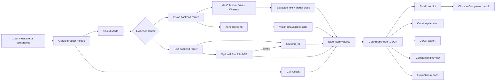
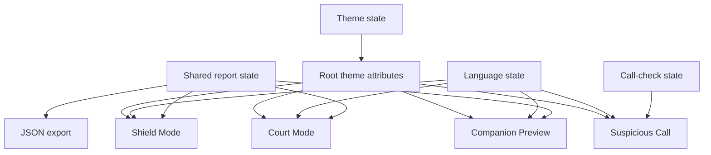
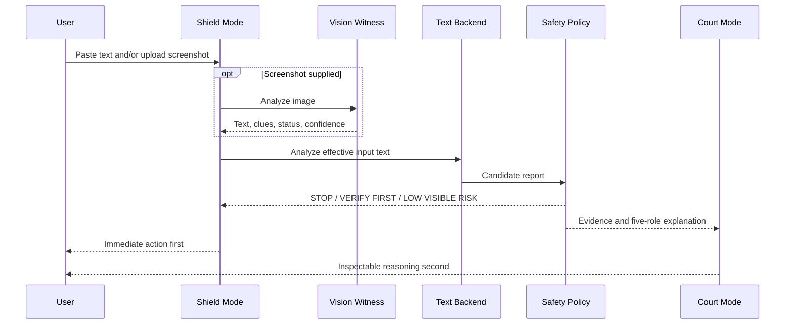
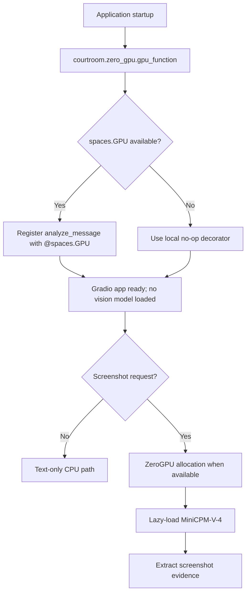
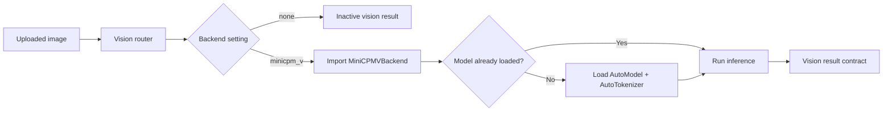
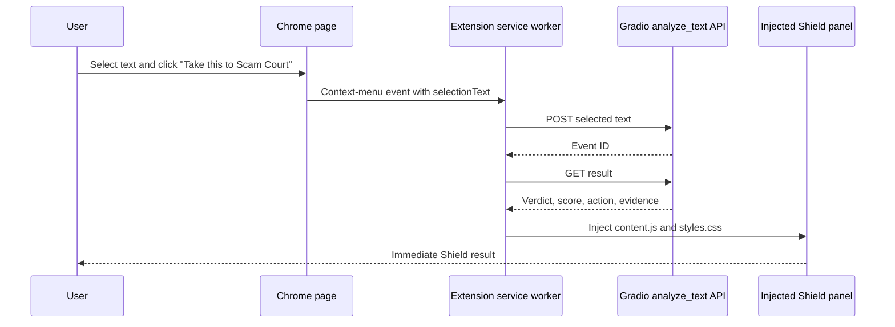
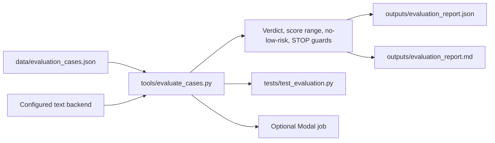
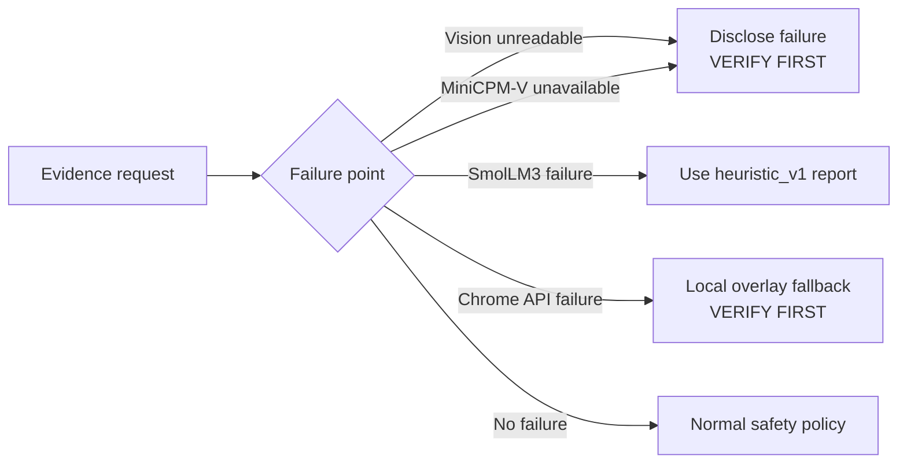

# Scam Court AI Architecture

## System Architecture

Scam Court AI separates evidence intake, optional model inference,
deterministic safety policy, structured reporting, and presentation. The
default path is CPU-safe and deterministic. Optional text and vision models are
lazy-loaded and fall back to conservative behavior.


The editable source for the rendered diagram is
[`assets/architecture/scam-court-architecture.mmd`](assets/architecture/scam-court-architecture.mmd).



## Runtime Components

| Component | Responsibility |
|---|---|
| `app.py` | Gradio layout, event handlers, evidence orchestration, renderers, and named companion endpoint |
| `courtroom/config.py` | Environment-based text and vision backend selection |
| `courtroom/backends/` | Heuristic adapter, optional SmolLM3 adapter, and fallback routing |
| `courtroom/engine.py` | Pattern detection, weighted score, safety policy, and `CourtroomReport` |
| `courtroom/vision_backends/` | No-vision fallback and MiniCPM-V implementation |
| `courtroom/zero_gpu.py` | Real `@spaces.GPU` integration with local no-op compatibility |
| `chrome_companion/` | Manifest V3 selected-text client |
| `tools/evaluate_cases.py` | Local evaluation runner and JSON/Markdown report generation |
| `modal/eval_modal_job.py` | Optional remote execution of the same deterministic evaluation |

## Gradio UI Architecture

The UI is a set of product views over shared analysis state rather than a
collection of independent demos.



`app.py` owns Gradio component construction and event wiring. Render helpers
turn the report into HTML for verdict cards, Vision Witness evidence, court
roles, and companion previews. `courtroom/ui/i18n.py` contains the translation
catalog, while `courtroom/ui/styles.py` defines the shared visual system.

Language and theme are explicit UI state. They do not alter model IDs, JSON
keys, environment variables, or the underlying safety decision.

## Evidence and Decision Flow

1. Gradio receives pasted text, an uploaded screenshot, or call-check factors.
2. Uploaded images are sent to the configured vision backend.
3. Successful screenshot text is combined with pasted text as
   `effective_input_text`.
4. The configured text backend analyzes the effective text.
5. The deterministic policy applies minimum actions for sensitive requests,
   action links, incomplete evidence, and model failures.
6. Vision provenance, backend identity, evidence, and limitations are attached
   to the `CourtroomReport`.
7. Shield, Court, Companion Preview, JSON export, and external integrations
   render from the same structured decision.

## Shield and Court Flow



The courtroom roles are presentation stages over the shared report:

- **Detective:** visible evidence and pattern collection.
- **Prosecutor:** manipulation and risk argument.
- **Defender:** plausible benign interpretation and uncertainty.
- **Judge:** verdict, severity score, and summary.
- **Safety Clerk:** immediate action, trusted-contact script, and next steps.

## ZeroGPU Flow



The decorator is visible during Hugging Face Space startup, satisfying ZeroGPU
registration requirements. Registering the function does not download or
initialize MiniCPM-V. The GPU allocation surrounds the shared handler that may
invoke vision inference.

## MiniCPM-V Lazy Loading

The vision router imports `MiniCPMVBackend` only when
`SCAM_COURT_VISION_BACKEND=minicpm_v`. The backend initializes
`openbmb/MiniCPM-V-4` on the first image request, not at application import.



The result includes status, model ID, screenshot type, extracted text, visual
clues, recommended text for analysis, confidence, and an error field when
needed.

Vision is evidence extraction, not the final authority. The deterministic
policy still decides whether the user should stop, verify independently, or
continue with normal caution.

## Fallback Strategy

| Condition | Required behavior |
|---|---|
| OTP, password, PIN, recovery-code, or credential request | `STOP` |
| Family impersonation plus money | `STOP` |
| Gift card, crypto, transfer, or off-platform deposit request | `STOP` |
| Package, bank, invoice, government, or ambiguous action link | At least `VERIFY FIRST` |
| Screenshot-only input cannot be analyzed | `VERIFY FIRST`; disclose that vision was unavailable |
| Optional SmolLM3 load, generation, or parsing failure | Return the deterministic heuristic report with fallback provenance |
| Chrome Companion API failure | Render a local `VERIFY FIRST` fallback |
| No strong visible signal and sufficient analyzable text | `LOW VISIBLE RISK` with normal-caution wording |

Risk scores are policy severity indicators, not calibrated probabilities.
Fallbacks are designed to preserve safety and product availability without
pretending a failed model completed its task.

## CourtroomReport Contract

`CourtroomReport` is the shared boundary between analysis and every product
surface. Major field groups include:

- identity: `report_id`, `created_at`, `schema_version`;
- decision: `risk_score`, `risk_level`, `verdict`, `shield_verdict`;
- evidence: `detected_patterns`, `evidence_items`, `scenario_tags`;
- court: Detective, Prosecutor, Defender, Judge, and Safety Clerk outputs;
- action: `immediate_action`, `trusted_contact_script`, `next_steps`;
- provenance: effective input, input sources, backend identity, and vision state;
- observability: agent trace and fallback markers;
- transparency: limitations and blocked-analysis reasons.

See [`INTEGRATION_CONTRACT.md`](INTEGRATION_CONTRACT.md).

## Chrome Companion Architecture

The implemented Manifest V3 prototype is explicit-selection only.



Privacy boundaries:

- no persistent content script or DOM observer;
- no background page scanning;
- no automatic message reading;
- only `selectionText` from the explicit context-menu action is submitted;
- selected message text is not written to extension storage;
- no history, cookie, bookmark, clipboard, or web-request permissions;
- API failure becomes `VERIFY FIRST`.

The extension calls the named text-only Gradio endpoint and does not invoke
MiniCPM-V. See
[`CHROME_COMPANION_PROTOTYPE.md`](CHROME_COMPANION_PROTOTYPE.md).

## Evaluation Architecture



Each synthetic case defines a category, expected verdict, accepted score range,
rationale, tags, and whether `LOW VISIBLE RISK` is prohibited. The runner
collects verdict accuracy, score-range accuracy, category pass rates, STOP
recall, false reassurance count, and safety failures.

Generated reports are ignored because they are reproducible from committed
inputs. The same runner can execute locally or through the optional Modal job;
Modal is not imported by the Gradio application.

## Privacy Boundaries

| Boundary | Design |
|---|---|
| Local heuristic mode | No third-party model API is required |
| Public Space | Evidence is processed inside the Hugging Face Space runtime |
| Screenshot lifecycle | The application does not intentionally persist uploads |
| Runtime diagnostics | Backend and error metadata are logged; message and screenshot contents are not |
| JSON export | Initiated by the user |
| Chrome Companion | Sends only explicitly selected text after the context-menu action |
| Browser monitoring | No persistent content script, DOM observer, history, cookie, bookmark, or clipboard access |
| Credentials | `.env`, Hugging Face tokens, Modal tokens, caches, and model weights are excluded from version control |

The application is not an identity-verification service. It does not query live
bank, carrier, sender, domain-reputation, or payment systems. Independent
verification remains an explicit user action.

## Failure Matrix



The system distinguishes availability from confidence. A component failure
does not become a low-risk conclusion and is never hidden behind an invented
analysis result.

## Deployment Profiles

### CPU-Safe

```text
SCAM_COURT_BACKEND=heuristic
SCAM_COURT_VISION_BACKEND=none
SCAM_COURT_VISION_MODEL=openbmb/MiniCPM-V-4
```

### Hugging Face ZeroGPU

```text
SCAM_COURT_BACKEND=heuristic
SCAM_COURT_VISION_BACKEND=minicpm_v
SCAM_COURT_VISION_MODEL=openbmb/MiniCPM-V-4
```

### Optional Small Text Model

```text
SCAM_COURT_BACKEND=smollm3
```

SmolLM3 remains optional. Its adapter falls back to the deterministic engine
when model loading, generation, or structured parsing fails.
