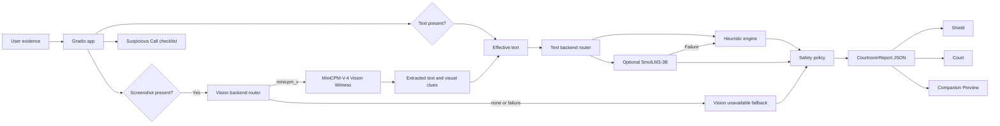
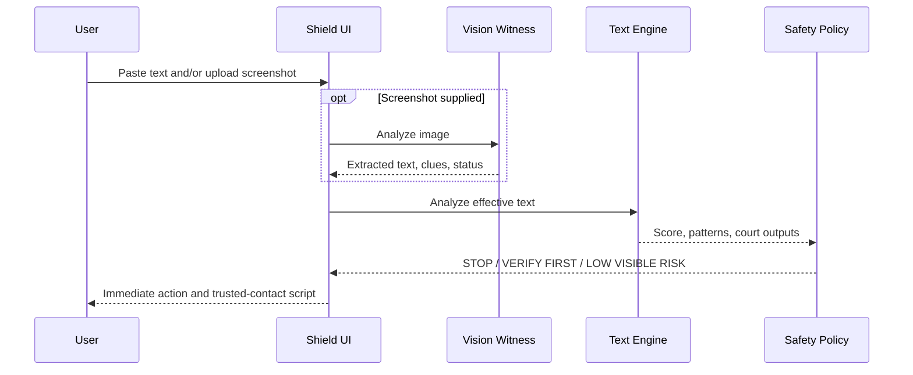
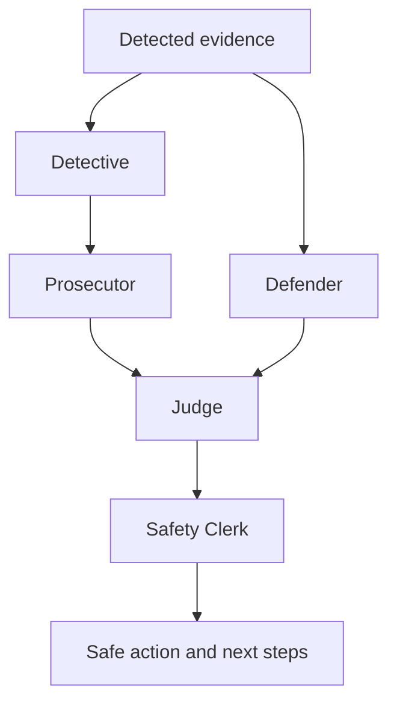
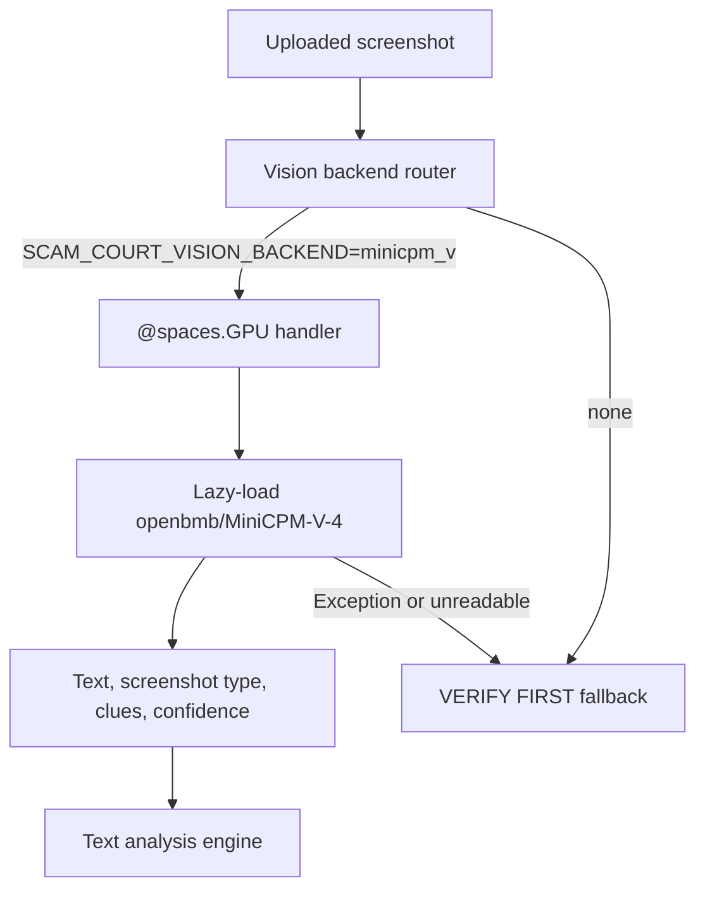
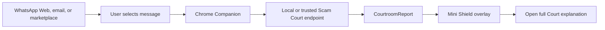

# Scam Court AI Architecture

## System Overview

Scam Court AI separates evidence extraction, text analysis, safety policy, and
presentation. The default path is deterministic and CPU-safe. Optional model
paths are lazy-loaded and fall back to conservative behavior.



## Runtime Components

| Component | Responsibility |
|---|---|
| `app.py` | Gradio construction, event handlers, rendering, screenshot/text orchestration |
| `courtroom/config.py` | Environment-based backend selection |
| `courtroom/backends/` | Text backend router, heuristic adapter, optional SmolLM3 |
| `courtroom/engine.py` | Detection, weighted score, safety policy, court outputs |
| `courtroom/vision_backends/` | Vision router, no-vision fallback, MiniCPM-V |
| `courtroom/zero_gpu.py` | Real `@spaces.GPU` on Spaces and local no-op compatibility |
| `tools/evaluate_cases.py` | Reproducible dataset evaluation and reports |
| `modal/eval_modal_job.py` | Optional remote execution of the same evaluation |

## Main Data Flow

1. Gradio receives pasted text and/or an image path.
2. If an image exists, the configured vision backend runs.
3. Extracted screenshot text is combined with pasted text into
   `effective_input_text`.
4. The configured text backend analyzes that text.
5. The safety policy applies conservative minimum scores and actions.
6. Vision provenance and failure state are attached to the report.
7. All UI modes render from the structured result.

## Shield Mode Flow



Shield prioritizes the action headline. It does not require the user to read the
full court output.

## Court Mode Flow

Court Mode uses the same analysis result as Shield Mode:



The roles are structured stages in the report:

- evidence collection;
- risk argument;
- alternative explanation;
- verdict and score;
- user-facing safety action.

## Vision Witness Flow



MiniCPM-V is not imported and initialized as an application startup
requirement. Screenshot failure is represented in `vision_status` and
`vision_error`. Screenshot-only failure cannot produce `LOW VISIBLE RISK`.

## ZeroGPU Execution

The shared `analyze_message` handler is registered through `@spaces.GPU`.
`courtroom/zero_gpu.py` imports `spaces` safely:

- On Hugging Face ZeroGPU, the real decorator is visible during startup.
- Locally, unavailable ZeroGPU support becomes a no-op decorator.
- Registering the function does not load MiniCPM-V.
- The GPU allocation surrounds the code path that may invoke vision inference.

Startup diagnostics report the text backend, vision backend, model ID, Space
decorator state, runtime state, UI version, build marker, and port.

## Backend Router

Text backend selection:

```text
SCAM_COURT_BACKEND=heuristic  # default
SCAM_COURT_BACKEND=smollm3    # optional
```

Vision backend selection:

```text
SCAM_COURT_VISION_BACKEND=none       # CPU-safe default
SCAM_COURT_VISION_BACKEND=minicpm_v  # screenshot inference
SCAM_COURT_VISION_MODEL=openbmb/MiniCPM-V-4
```

If SmolLM3 fails to load or return valid structured output, its adapter returns
the heuristic report with a fallback marker.

## JSON Report Contract

`CourtroomReport` is the shared contract for rendering and export. Major field
groups include:

- identity: `report_id`, `created_at`, `schema_version`;
- decision: `risk_score`, `risk_level`, `verdict`, `shield_verdict`;
- evidence: `detected_patterns`, `evidence_items`, `scenario_tags`;
- court: Detective, Prosecutor, Defender, Judge, Safety Clerk outputs;
- action: `immediate_action`, `trusted_contact_script`, `next_steps`;
- provenance: text and screenshot input sources, vision status and model;
- observability: backend identity and agent trace;
- transparency: known limitations.

See [`INTEGRATION_CONTRACT.md`](INTEGRATION_CONTRACT.md).

## Safety Policy and Fallbacks

| Condition | Required behavior |
|---|---|
| OTP, password, or PIN request | `STOP` |
| Family impersonation plus money | `STOP` |
| Payment, gift card, or crypto request | `STOP` |
| Package, bank, invoice, or ambiguous action link | At least `VERIFY FIRST` |
| Screenshot-only input cannot be read | `VERIFY FIRST` |
| Optional text model fails | Use deterministic heuristic result |
| No visible risk signals | `LOW VISIBLE RISK` with normal-caution wording |

The score is a policy severity indicator, not a probability.

## Future Chrome Companion

The Companion Preview models a future explicit-selection integration:



Privacy boundaries for that design:

- no background page scanning;
- no clipboard monitoring;
- only user-selected content is submitted;
- local endpoint by default;
- remote endpoint is explicit opt-in.
